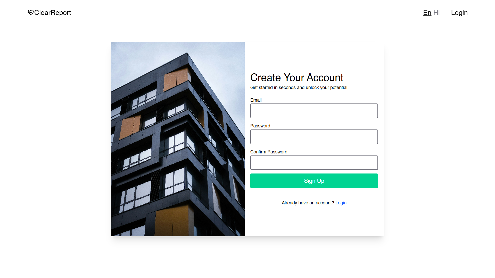
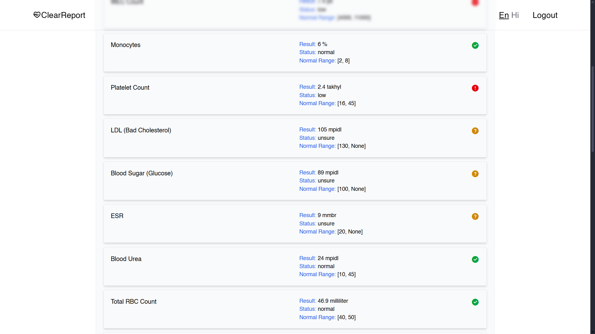
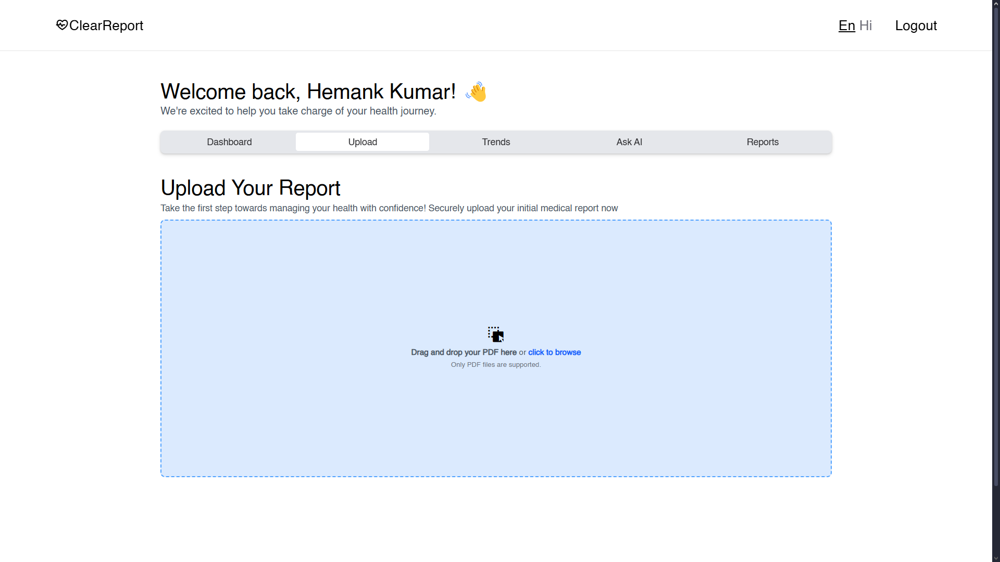
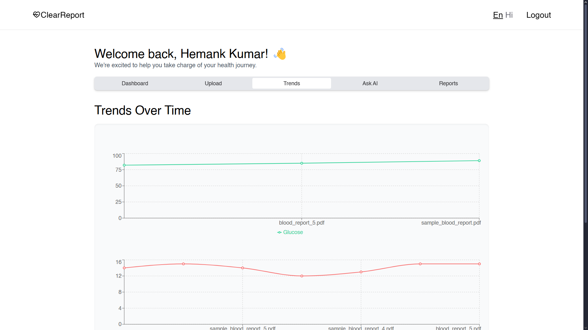
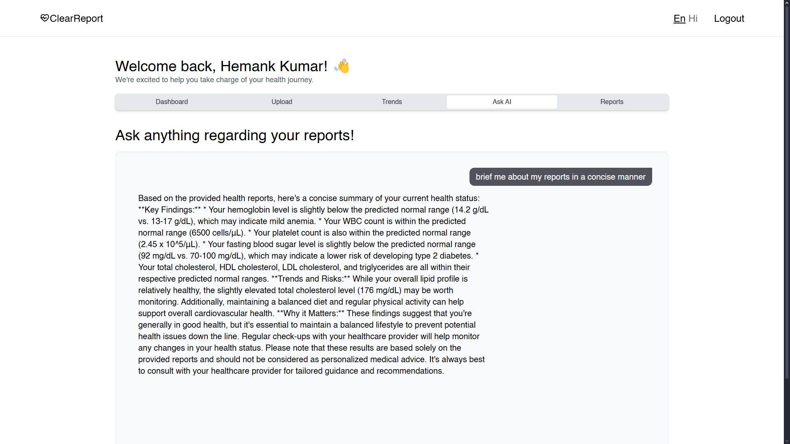
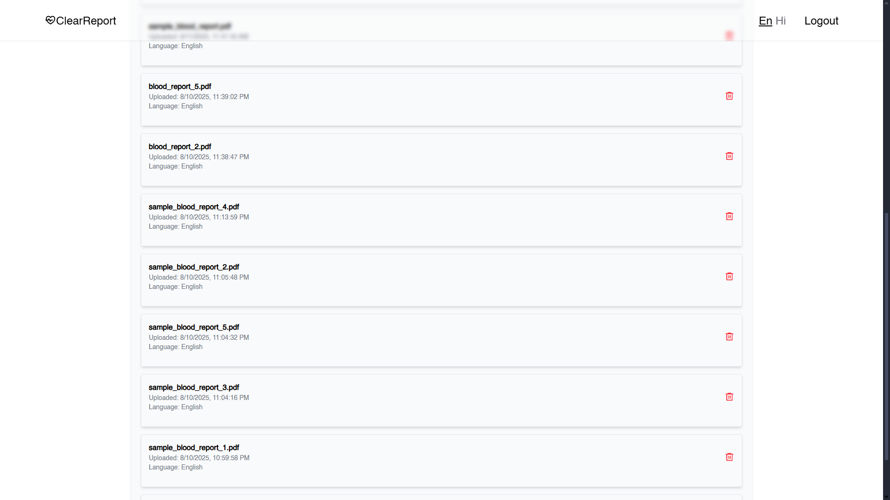

# ClearReport – Full Stack RAG Application

ClearReport is a full-stack Retrieval-Augmented Generation (RAG) application designed to process health reports, extract structured data, and provide AI-powered insights in natural language.

## 📸 Screenshots

### 1️⃣ Home Page


### 2️⃣ Sign Up


### 3️⃣ Latest Reports


### 4️⃣ Upload Report


### 5️⃣ Trends


### 6️⃣ Chat with AI


### 7️⃣ Reports Tab



## 📂 Project Structure
```
hemankkumar24-clearreport-full-stack-rag-application/
├── backend/         # FastAPI backend
├── frontend/        # React + Vite frontend
└── ml_backend/      # (Testing purposes only)
```

---

## 🚀 Prerequisites

Before starting, ensure you have the following installed:

- [Python 3.11+](https://www.python.org/downloads/)
- [Node.js 18+ & npm](https://nodejs.org/en/download)
- [Ollama](https://ollama.ai/download)
- [Tesseract OCR](https://tesseract-ocr.github.io/tessdoc/Installation.html) (ensure `tesseract` is in your system PATH)
- Supabase account and API keys
- Pinecone account and API key

---

## ⚙️ Environment Variables

Create a `.env` file inside the `backend/` directory with:

```env
SUPABASE_URL=your_supabase_url
SUPABASE_KEY=your_supabase_service_role_key
PINECONE_API_KEY=your_pinecone_api_key
```

---

## 📥 Step 1 – Install & Run Ollama

1. Install Ollama from [here](https://ollama.ai/download) and ensure it’s running.
2. Pull the required LLaMA model:
   ```bash
   ollama pull llama3.2
   ```
3. (Optional test) Run the model:
   ```bash
   ollama run llama3.2
   ```
   > You should be able to chat with the model in your terminal.

---

## 🖥️ Step 2 – Backend Setup

1. Navigate to the backend folder:
   ```bash
   cd backend
   ```

2. Install dependencies:
   ```bash
   pip install -r requirements.txt
   ```
3. Start the backend server:
   ```bash
   uvicorn main:app --reload
   ```
   Backend will run at **http://localhost:8000**

---

## 🌐 Step 3 – Frontend Setup

1. In a new terminal, navigate to the frontend folder:
   ```bash
   cd frontend
   ```
2. Install dependencies:
   ```bash
   npm install
   ```
3. Start the frontend development server:
   ```bash
   npm run dev
   ```
   Frontend will run at **http://localhost:5173**

---

## 🧪 Step 4 – Testing the Application

1. Ensure Ollama is running and the `llama3.2` model is available.
2. Start the backend (`uvicorn main:app --reload`).
3. Start the frontend (`npm run dev`).
4. Open your browser at **http://localhost:5173**
5. Sign up / log in via Supabase authentication.
6. Upload a health report PDF and ask AI-powered questions.

---

## 📌 Notes

- **`ml_backend/`**: This folder is for **testing purposes only** and is not part of the main deployment flow.
- Make sure `tesseract` is installed and configured in `backend/tesseract.py` (`pytesseract.pytesseract.tesseract_cmd` path may need adjusting).
- Ensure your Supabase and Pinecone indexes match what’s expected in the backend code.

---

## 🛠️ Tech Stack

- **Frontend**: React + Vite + Tailwind CSS
- **Backend**: FastAPI
- **Vector Search**: Pinecone
- **Auth & Database**: Supabase
- **LLM**: Ollama + LLaMA 3.2
- **OCR**: Tesseract

---

## 📄 License

MIT License – feel free to modify and use.
